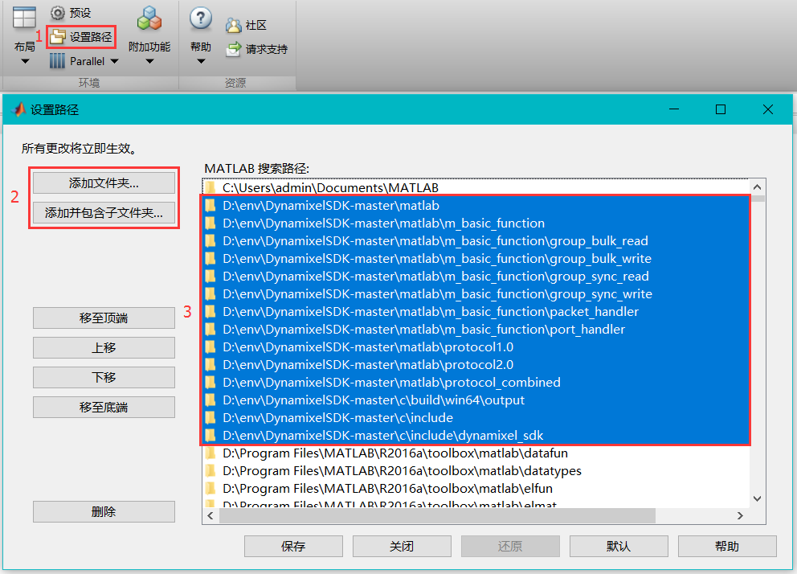
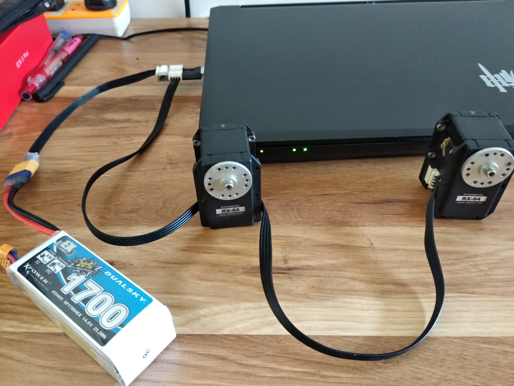

# Dynamixel
How to drive the motor

## 通过MATLAB驱动RX-64舵机

**工具：**
- MATLAB R2016a
- RX-64舵机
- usb转485串口转换器
- 电池

### 1.添加库文件
下载 [**DynamixelSDK**](https://github.com/ROBOTIS-GIT/DynamixelSDK)，因为写代码时会用到里面的库函数，按照下图将相关文件添加在 `MATLAB` 设置路径中：





### 2.连接舵机

连接如下图所示：
> 电池连接 `usb转485` 的后面，舵机连接侧面
>
>

### 3.执行代码

> 实现功能：用手转动一舵机到达某一角度，让另一个舵机也跟随其转到相应位置。

代码位于 `rx64_read_write.m`，代码中用到了[**控制表（Control Table）**](http://emanual.robotis.com/docs/en/dxl/rx/rx-64/#control-table-of-eeprom-area)，例如下面分别用到了 `Torque Enable`、`Goal Position`、`Present Position` 3个控制地址。

```matlab
% 控制表地址
ADDR_MX_TORQUE_ENABLE       = 24;           % Torque Enable (24)，0关1开
ADDR_MX_GOAL_POSITION       = 30;           % Goal Position (30)， 0 ~ 1023，单位 0.29°
ADDR_MX_PRESENT_POSITION    = 36;           % Present Position (36)， 0~1023，单位 0.29°
```